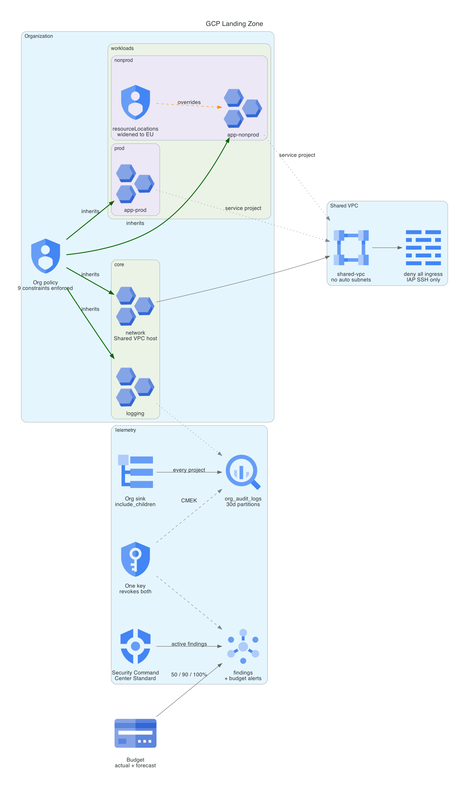

# GCP Landing Zone

An organization built as code: resource hierarchy, org policy enforced at the org root, a Shared VPC with no public path, centralized audit logging that covers projects created after the sink exists, and budget plus Security Command Center alerting on the detect side.

Every project is vended through one factory, so a project cannot exist without a folder, a billing link, audit logging, and the default network suppressed.



**Cost:** roughly $0.50 per month if left standing, dominated by one KMS key and a small BigQuery dataset. **Teardown:** documented, with the GCP-specific traps that make it non-obvious.

## The problem

A cloud organization decays in a predictable direction. Projects get created outside any hierarchy, each with a default VPC nobody chose and firewall rules nobody reviewed. Service account keys accumulate. Audit logs exist per project and nowhere centrally, so the question "who read that" has no answer. Spend is discovered monthly.

None of this is caused by bad engineers. It is caused by the defaults being wrong, and by every correct decision needing to be remade by each person who creates a project.

A landing zone moves those decisions to a place where they cannot be skipped: into the hierarchy itself, where inheritance does the enforcement.

## How GCP differs from AWS and Azure here

This project is the third of the same idea, after AWS Organizations with SCPs and an Azure Landing Zone with Azure Policy. The differences are the interesting part.

**Org policy constrains configuration, not callers.** An SCP is a deny boundary evaluated against IAM at request time: the call is authorized or it is not. Azure Policy evaluates resources and can deny, audit, or mutate through effects. GCP org policy constrains the *shape of the configuration itself*, so the API rejects a resource that violates a constraint. The violation cannot exist rather than being disallowed to whoever asked.

**Exceptions work in the opposite direction.** An SCP deny cannot be un-denied further down the tree, so AWS exceptions are granted by moving accounts to a different OU. GCP list constraints support a child policy that widens an inherited one. This repo demonstrates it deliberately: `gcp.resourceLocations` allows US locations at the org, and `nonprod` overrides it to add EU for a residency test, without weakening the policy anywhere else.

**IAM inherits down the hierarchy too.** In AWS, an OU is a policy attach point but IAM lives in the account. In GCP a role granted at a folder applies to every project beneath it, forever, including projects that do not exist yet. That makes folder design a security decision, not an org-chart decision.

## What gets built

**Hierarchy.** `core` holds platform-owned projects (network, logging). `workloads` splits into `nonprod` and `prod`. The two workload projects are identical except for placement, which is the whole point: they are governed differently without either carrying policy code.

**Org policy, nine constraints at the organization root.** Applied at the org rather than the folder, because a policy attached to a folder is bypassed by creating a project somewhere else.

| Constraint | What it prevents |
|---|---|
| `iam.disableServiceAccountKeyCreation` | Long-lived JSON keys that authenticate forever from anywhere |
| `iam.disableServiceAccountKeyUpload` | The same, via the upload path |
| `compute.skipDefaultNetworkCreation` | A default VPC with permissive rules nobody chose |
| `compute.disableSerialPortAccess` | A console path that bypasses SSH controls and OS Login |
| `compute.requireOsLogin` | SSH keys in instance metadata, revocable only by hunting them down |
| `sql.restrictPublicIp` | Databases on public addresses |
| `storage.uniformBucketLevelAccess` | Legacy ACLs that reason about objects one at a time |
| `compute.vmExternalIpAccess` | External IPs on VMs, denied as a list constraint |
| `gcp.resourceLocations` | Resources outside approved geography |

`iam.allowedPolicyMemberDomains` is written but **off by default**, and the default is the point: it blocks binding `allUsers`, which breaks any public Cloud Run service. Enabling it without knowing that is how a landing zone quietly blocks a workload the org intends to run.

**Shared VPC.** One host project owns the network; workload projects attach as service projects and consume a subnet they do not own. Network policy is set once and inherited rather than re-argued per project. The subnet carries flow logs, Private Google Access, and secondary ranges sized for a future GKE cluster. Firewall is explicit default-deny plus SSH from the IAP forwarding range only, so there is no public SSH path at all. Access is granted per subnet rather than per project, which is the least-privilege form of Shared VPC.

**Centralized logging.** An organization sink with `include_children` ships admin activity, data access, system event, and policy denial logs to a partitioned BigQuery dataset. Projects created tomorrow are covered without touching the sink. Partition expiry bounds both retention and cost, since audit volume is the line item that surprises people.

**Detect.** Security Command Center Standard, which is free, streams active unmuted findings to Pub/Sub. A budget on the whole billing account alerts at 50, 90, and 100 percent of actual spend plus a forecast rule, because a landing zone that governs security but not spend is half a landing zone.

**CMEK across telemetry.** The audit dataset and both Pub/Sub topics share one key, so a single disable revokes the org's entire audit trail and finding stream at once, with no IAM edit and nothing deleted.

## Deploy

Requires an org, an open billing account, and these roles. Three of the four are commonly missing, and each was found by an apply failing:

| Role | Needed for |
|---|---|
| `resourcemanager.organizationAdmin` | Org IAM |
| `resourcemanager.folderAdmin` | Creating and deleting folders. **Not** in `organizationAdmin` |
| `orgpolicy.policyAdmin` | The constraints. **Not** in `organizationAdmin` |
| `compute.xpnAdmin` | Enabling the Shared VPC host. **Not** in `organizationAdmin` |
| `logging.configWriter` | Creating the organization sink. **Not** in `organizationAdmin` |
| `billing.admin` | Linking billing and creating the budget |
| `securitycenter.notificationConfigEditor` | The SCC notification config. Was **not sufficient** on its own here, see below |

The pattern is worth internalizing: `organizationAdmin` administers IAM policy at the organization and grants almost none of the operational org-level permissions. Four separate roles had to be added, each discovered by an apply failing on exactly one resource.

```bash
# 1. Seed project and state bucket. Local state, because this creates the bucket.
cd bootstrap
cp terraform.tfvars.example terraform.tfvars   # org_id, billing_account
terraform init && terraform apply

# 2. Point the landing zone at that bucket.
cd ../terraform
terraform -chdir=../bootstrap output -raw backend_hcl > backend.hcl
cp terraform.tfvars.example terraform.tfvars   # add org_id, billing_account, seed_project_id

# 3. The organization itself.
terraform init -backend-config=backend.hcl
terraform apply
```

Applying with user credentials requires a quota project, or `orgpolicy` calls bill to Google's shared OAuth client project and fail with a confusing `SERVICE_DISABLED`:

```bash
gcloud auth application-default set-quota-project <seed-project-id>
```

## Validation

```bash
# Constraints are live at the org, not merely declared.
gcloud org-policies list --organization="${ORG_ID}"

# Inheritance: prod gets the org policy, nonprod gets its override.
gcloud org-policies describe gcp.resourceLocations --folder="${PROD_FOLDER}" --effective
gcloud org-policies describe gcp.resourceLocations --folder="${NONPROD_FOLDER}" --effective

# The org sink is delivering. Empty means the writer identity grant is missing,
# which is the usual cause of a correct-looking sink shipping nothing.
bq query --use_legacy_sql=false \
  "SELECT COUNT(*) FROM \`${LOGGING_PROJECT}.org_audit_logs.cloudaudit_googleapis_com_activity\`"

# Shared VPC attachment.
gcloud compute shared-vpc get-host-project "${NONPROD_PROJECT}"
```

Three checks that prove a control by failing:

```bash
# A service account key cannot be issued.
gcloud iam service-accounts keys create /tmp/k.json --iam-account="${SA}"
# ERROR: FAILED_PRECONDITION ... constraints/iam.disableServiceAccountKeyCreation

# A resource outside approved locations is refused.
gcloud storage buckets create gs://test-asia --location=asia-northeast1 --project="${PROD_PROJECT}"
# ERROR: HTTPError 412: 'asia-northeast1' violates constraint 'constraints/gcp.resourceLocations'
```

Both are denied with the violated constraint named. Note that gcloud creates the key output file before calling the API, so check its size rather than its presence.

**A test that does not work, and why it is worth knowing.** The obvious third check is to create a network named `default` and expect a denial. It succeeds, and the constraint is not broken.

`compute.skipDefaultNetworkCreation` suppresses the default VPC that GCP would otherwise create *at project creation time*. It says nothing about networks created afterwards, and nothing about the name `default`. A user with network permissions can create a VPC called `default` any time, and it is an ordinary custom-mode network that happens to carry that name, without the permissive preset firewall rules the real default VPC ships with.

The control is about the project's starting state, not about a reserved name. Verify it by confirming a freshly vended project has zero networks:

```bash
gcloud compute networks list --project="${PROD_PROJECT}"   # Listed 0 items.
```

## What the live deploy taught

Five things that only surfaced against a real organization.

**A new GCP organization is not greenfield.** Google now pre-applies a secure-by-default org policy set, so three constraints this repo declares already existed: `iam.disableServiceAccountKeyCreation`, `iam.disableServiceAccountKeyUpload`, and `storage.uniformBucketLevelAccess`. The apply failed with `409 POLICY_ALREADY_EXISTS` on each. The fix is to import them, which is the correct instinct and carries a trap described in the teardown section below.

**Billing accounts cap linked projects.** A self-serve billing account allows a limited number of projects linked at once, and projects sitting in `DELETE_REQUESTED` still count for their full 30-day window. This landing zone wants five projects and the cap was reached at four, which is why `vend_nonprod_app` exists. The nonprod folder and its policy override work regardless, and an effective-policy query proves inheritance without a project inside the folder.

**A resource count must be knowable at plan time.** The service project attachment originally used `count = var.shared_vpc_host_project == "" ? 0 : 1`, and the host project ID is generated in the same apply. Terraform refuses: the count value depends on attributes that cannot be determined until apply. A resource's *arguments* may be unknown at plan time; its *count* may not. Hence a separate `attach_shared_vpc` boolean.

**Security Command Center needs more than the notification role.** `securitycenter.notificationConfigEditor` at the organization was not sufficient to create a notification config, which continued to fail with `securitycenter.notificationconfig.create` denied. SCC activation state at the org appears to be the gate. `enable_scc_notifications` defaults to true and was set false for the verified run, so the Pub/Sub topics exist and the SCC config does not.

**`skipDefaultNetworkCreation` does not mean what the name suggests.** See the validation section. It governs the project's starting state, not the name `default`.

## What changes at production scale

**Terraform runs as a service account, not as you.** Everything here applies with user ADC. Production runs it through workload identity federation from CI, with the seed project holding the identity and no human holding org-level roles day to day.

**Policy exceptions need a request path.** The `nonprod` override is hardcoded. In production an exception is requested, approved, time-boxed, and reviewed, and the absence of that workflow is the reason landing zones erode.

**No Cloud NAT, deliberately.** Private instances have no outbound internet here. NAT is the correct answer and is also the only always-on billed resource this design would have, at roughly $0.044 per gateway-hour plus data processing. Production budgets for it.

**The findings topic has no subscriber.** The pipe is real, the consumer is not built. Findings accumulate and nothing triages them, which is honest rather than hidden.

**One region, one environment pair.** Real orgs need multi-region networking, a hub-and-spoke or Network Connectivity Center topology, and more than two workload projects before the factory's value is proven.

**No break-glass.** Removing key creation org-wide is correct until federation breaks and a human needs in. Production needs a documented, alerted, time-boxed exception path.

## Teardown

```bash
cd terraform && terraform destroy
cd ../bootstrap && terraform destroy   # set force_destroy_state = true first
```

GCP behaviors that make this non-obvious:

**Importing a policy makes you its owner, and destroy then deletes it.** This is the sharpest trap in the whole build and it was hit for real. The three constraints Google pre-applied were imported to resolve the 409s, which handed Terraform ownership of policies it did not create. `terraform destroy` deleted them, leaving the organization *less protected than before the landing zone was ever applied*, with service account key creation newly permitted org-wide.

They were restored manually afterwards:

```bash
for c in iam.disableServiceAccountKeyCreation iam.disableServiceAccountKeyUpload storage.uniformBucketLevelAccess; do
  gcloud resource-manager org-policies enable-enforce "$c" --organization="${ORG_ID}"
done
```

Adopting existing infrastructure is a two-way door only if you know which side you came in on. A production version tracks which constraints pre-existed and either leaves them unmanaged or guards them with `prevent_destroy`.

**Org policies are deleted, not reverted.** Destroy removes the policy resources and the org returns to Google's defaults for anything Google set, and to no policy at all for anything it did not. There is no "previous state" that Terraform restores for you.

**Folders must be empty.** A folder with a project in it, including one in `DELETE_REQUESTED`, blocks deletion. Terraform's dependency order handles this, but a manually created project in a managed folder will strand the destroy.

**KMS key rings cannot be deleted, ever.** Destroy removes the ring from state and leaves it in the project. Deleting the seed project takes it with it. An empty ring costs nothing.

**Deleted projects linger for 30 days** in `DELETE_REQUESTED` and their IDs are never reusable. They still appear in `gcloud projects list`, which looks like a failed teardown and is not one. Confirm lifecycle state and the billing link rather than absence of the row.

**The log sink is org-level.** It is not deleted by deleting a project. Terraform removes it, but a partial destroy can leave an org sink writing to a dataset that no longer exists, which fails silently.

## Deploy record

Deployed, verified, and destroyed on 2026-08-10 against organization `jordandn13-org`.

| Step | Result |
|---|---|
| Bootstrap | Seed project, state bucket, log bucket, audit config |
| Landing zone | 52 resources: 4 folders, 9 org policy constraints, 3 vended projects, Shared VPC with 2 firewall rules, org sink, BigQuery dataset, CMEK key, 2 Pub/Sub topics, budget |
| Inheritance proven | `prod` resolves `gcp.resourceLocations` to US value groups only; `nonprod` resolves to US plus europe and EU, from a child policy widening the inherited one |
| Shared VPC | `gcloud compute shared-vpc get-host-project` on the workload project returns the host project |
| Org sink | Delivering to BigQuery with `includeChildren = True` |
| Key creation denied | `FAILED_PRECONDITION`, `constraints/iam.disableServiceAccountKeyCreation` |
| Out-of-region denied | `HTTPError 412: 'asia-northeast1' violates constraint 'constraints/gcp.resourceLocations'` |
| Not deployed | SCC notification config, blocked on org permissions beyond `notificationConfigEditor` |
| Teardown | 52 then 18 resources destroyed. Zero folders remain, seed project `DELETE_REQUESTED` with billing unlinked, three pre-existing org policies restored by hand |
| Cost | Under $0.20 for the full cycle |
